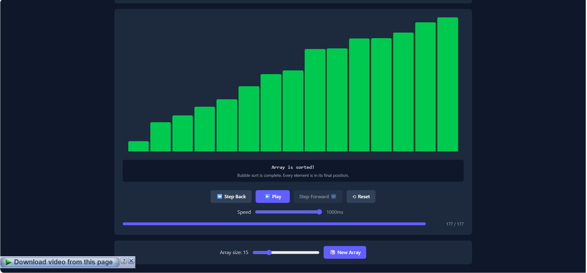

# Algo Visualizer 🧪

> Interactive platform to **visualize**, **learn**, and **master** algorithms.



## 🎯 Why?

Learning algorithms is hard. Textbooks are dry. Videos are passive.

Algo Visualizer shows you *exactly* what happens at each step, with live explanations and a pseudocode panel (coming soon).

## ✨ Features

- [x] Bubble Sort visualization with playback controls
- [x] Step forward/back, speed control, array regeneration
- [x] Live description and explanation per step
- [ ] Merge Sort, Quick Sort, Heap Sort
- [ ] Pseudocode panel synced with animation
- [ ] "Learn" panel with key ideas and common mistakes
- [ ] Interactive quizzes
- [ ] Pathfinding visualizer (BFS, DFS, Dijkstra, A*)

## 🛠️ Tech Stack

- React + TypeScript + Vite
- Tailwind CSS v4
- (planned) FastAPI + PostgreSQL backend

## 🚀 Running Locally

```bash
git clone https://github.com/Sajghaa/algo-visualizer.git
cd algo-visualizer
npm install
npm run dev