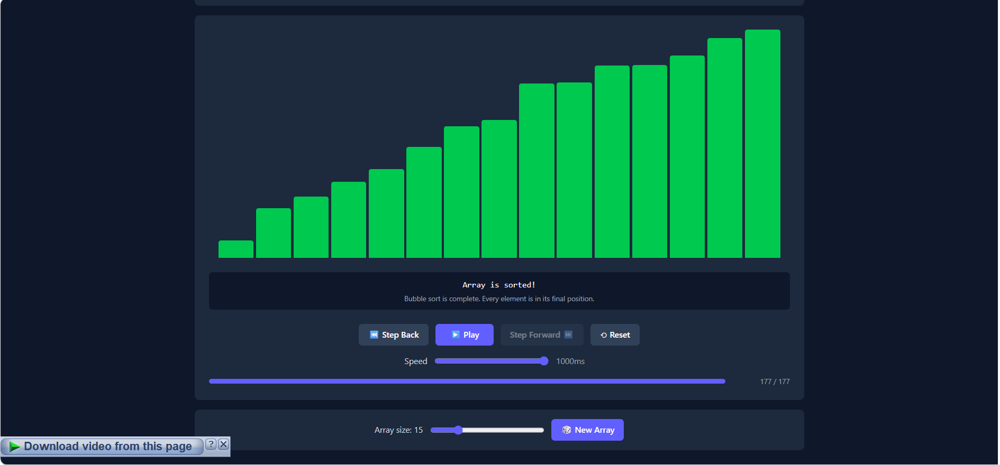
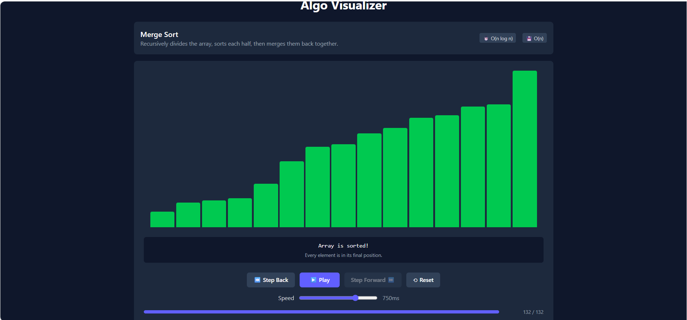
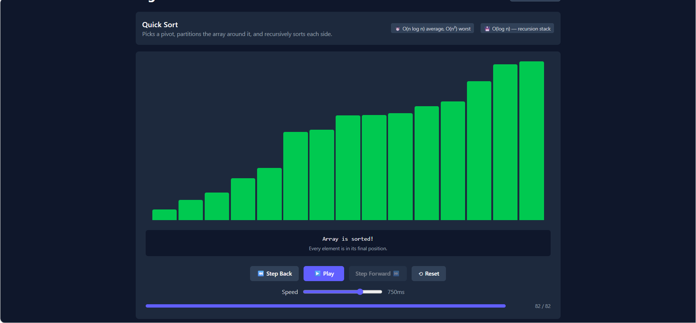

# Algo Visualizer 🧪

> Interactive platform to **visualize**, **learn**, and **master** algorithms.

**[🌐 Live Demo](https://algo-visualizer-eight-sigma.vercel.app)** — sign up to save progress across devices.

## Bubble Sort

## Merge Sort

## Quick Sort

## 🎯 Why?

Learning algorithms is hard. Textbooks are dry. Videos are passive.

Algo Visualizer shows you *exactly* what happens at each step, with live explanations and a pseudocode panel (coming soon).

## ✨ Features

- [x] Bubble Sort, Merge Sort, Quick Sort, Heap Sort visualizations
- [x] Step-by-step animation with playback controls
- [x] Pseudocode panel synced with animation
- [x] Learn panel with key ideas and when-to-use guidance
- [x] Interactive quiz mode with instant feedback
- [x] Progress dashboard (attempts, best, latest, last attempted)
- [x] **User accounts with JWT authentication**
- [x] **Per-user progress sync across devices**
- [x] Shareable URLs

## 🛠️ Tech Stack

**Frontend:** React 19, TypeScript, Vite, Tailwind CSS v4
**Backend:** FastAPI, SQLModel, PostgreSQL (Neon), JWT (python-jose), bcrypt (passlib)
**Infra:** Vercel (frontend), Render (backend), Neon (database)

## 📐 Architecture

\`\`\`
User → Vercel (React SPA) → Render (FastAPI) → Neon (PostgreSQL)
                    ↓
            JWT in localStorage
            Bearer header on every request
\`\`\`

## 🔐 Security

- Passwords hashed with bcrypt (cost factor 12)
- JWT tokens with 7-day expiration
- User-scoped queries — data isolation enforced at the DB layer
- CORS locked to specific origins
- User enumeration protection on login
- No password hashes ever leave the backend

## ⚠️ Known Limitations

- JWT stored in localStorage (XSS-vulnerable). Production apps should use httpOnly cookies.
- No email verification, password reset, or refresh tokens yet.
- Progress cache is per-browser, not per-user. Logging in as a different user on the same browser wipes the local cache and re-syncs from the backend.
- Frontend reloads after login/logout for clean state.

## 🚀 Running Locally

\`\`\`bash
# Backend
cd backend
python -m venv .venv
.venv\Scripts\activate  # or source .venv/bin/activate
pip install -r requirements.txt
uvicorn app.main:app --reload

# Frontend (new terminal)
npm install
npm run dev
\`\`\`

## 📄 License

MIT